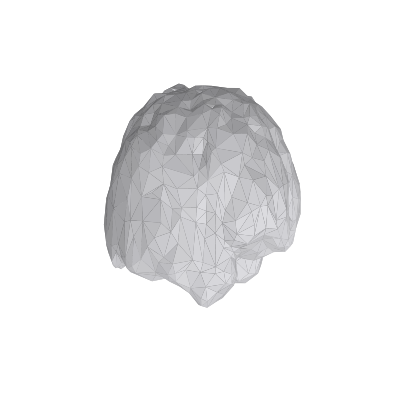

# Printable Brain (STL)

A watertight cortical-envelope mesh ready to slice and 3D-print.



| | |
|---|---|
| **File** | `brain.stl` (~120k faces) |
| **Source** | `example_data/aparc+aseg.nii.gz` (label volume — no facial data) |
| **Units** | millimetres (1 unit = 1 mm) |
| **Watertight** | yes (closed envelope) |

## Reproduce
```bash
python contributions/anatomical-models/printable-brain/build.py
```

## Printing instructions

1. **Scale** — the mesh is life-size in mm (~165 mm long). Scale to taste; a
   60–90 mm desk model prints fast and reads well.
2. **Orientation** — lay the brain on its **inferior (bottom) face** so the
   flat-ish base sits on the plate; minimises supports on the gyri.
3. **Supports** — tree/organic supports only under deep overhangs (temporal
   poles, brainstem stub). Gyral folds are self-supporting at ≤45°.
4. **Layer height** — 0.12–0.16 mm to keep sulci crisp; 0.2 mm for a quick draft.
5. **Material** — PLA or resin. Resin (SLA) captures the sulci far better; PLA
   FDM is fine for a teaching prop.
6. **Walls / infill** — 3 perimeters, 10–15 % infill is plenty (it's decorative).

### Stand / base (подножка)

Two easy options:

- **Cradle ring** — print a 5 mm-thick torus (inner Ø ≈ 0.6× the model width) the
  brain nests into; keeps it from rolling. Generate one in your slicer or add a
  `trimesh.creation.annulus` in a custom build.
- **Flat plinth** — slice the model with a 2–3 mm planar cut on the inferior
  surface (most slicers: "place on face") to give a stable flat bottom, then glue
  to a small printed/wooden plinth.

> Tip: export a separate `base.stl` and print it in a contrasting filament.

## Privacy

This model is built from a **label volume** (parcellation), which contains no
skin/skull/face — safe to share and print. Never derive a printable model from a
raw, un-defaced T1.

---

## 🧠 Brain-character catalog (wishlist for contributors)

Stylised "brain creatures" the community can model next — fan-art / parody, ship
your own original mesh, respect each franchise's IP:

1. **Intellect Devourer** — *Dungeons & Dragons*
2. **Suguru Geto** — *Jujutsu Kaisen*
3. **Mother Brain** — *Metroid*
4. **Krang** — *Teenage Mutant Ninja Turtles*
5. **Mojo Jojo** — *The Powerpuff Girls*
6. **Nomu** — *My Hero Academia*
7. **Megamind**

> These are **inspiration prompts**, not bundled assets. Contribute an original
> sculpt under `contributions/anatomical-models/<yourhandle>-<character>/` with
> your own license; do not commit copyrighted meshes.
