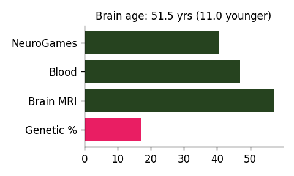
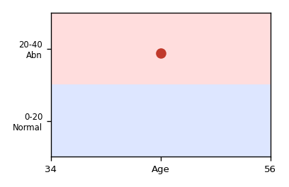
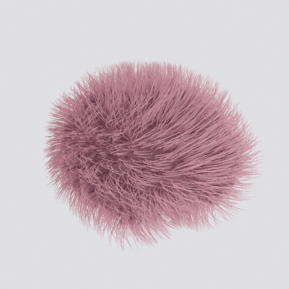
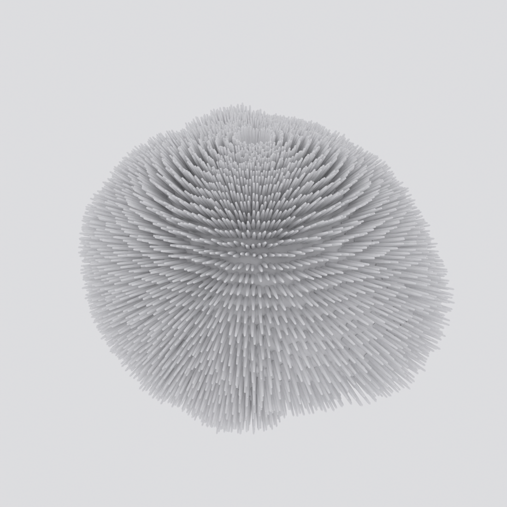
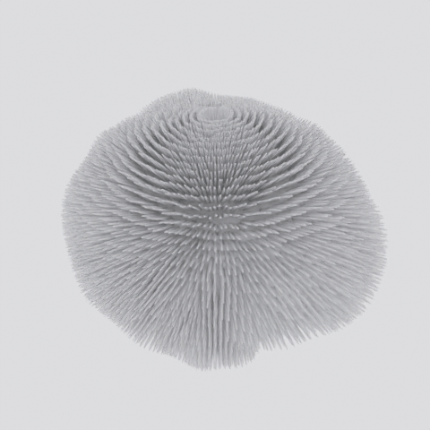

# Gallery

6 community contribution(s) across 3 categor(ies). Add yours — see [CONTRIBUTING.md](../CONTRIBUTING.md).

## 📊 Reports

<table>
<tr>
<td align='center' width='33%'> <b>Brain-Age Report</b> @kondratevakate · report</td>
<td align='center' width='33%'> <b>Perivascular Spaces (PVS) Report</b> @kondratevakate · report</td>
</tr>
</table>

## 🧠 Anatomical Models (3D-printable)

<table>
<tr>
<td align='center' width='33%'> <b>Printable Brain (STL)</b> @kondratevakate · model</td>
</tr>
</table>

## 🎨 3D Art

<table>
<tr>
<td align='center' width='33%'> <b>Furry Brain Dog-Shake (pink)</b> @kondratevakate · animation</td>
<td align='center' width='33%'> <b>Radial Pin Brain</b> @kondratevakate · figure</td>
<td align='center' width='33%'> <b>Pin-Whip Brain (animation)</b> @kondratevakate · animation</td>
</tr>
</table>

